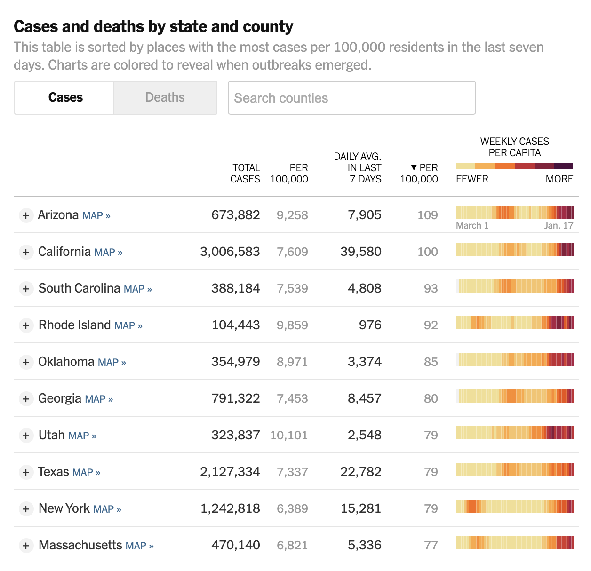

In May 2020, the Georgia Department of Public Health posted the following plot to illustrate the number of confirmed COVID-19 cases in their hardest-hit counties over a two-week period. Health officials claimed that the plot provided evidence that COVID-19 cases were decreasing and made the argument for reopening the state.

{ width=75% }

The plot was heavily criticized by the statistical community and several media outlets for its deceptive portrayal of COVID-19 trends in Georgia. Whether the end result was due to malicious intent or simply poor judgment, it is incredibly irresponsible to publish data visualizations that obscure and distort the truth. 

Data visualization is an incredibly powerful tool that can affect health policy decisions. Ensuring they are easy to interpret, and more importantly, showcase accurate insights from data is paramount for scientific transparency and the health of individuals. For this assignment you are tasked with reproducing COVID-19 visualizations and tables published by the [New York Times](https://www.nytimes.com/interactive/2020/us/coronavirus-us-cases.html).
Specifically, you will attempt to reproduce the following for January 12th, 2022:

1. New cases as a function of time with a rolling average plot - the first plot on the page (you don't need to recreate the colors or theme)
2. Table of cases and deaths - the first table on the page
3. The county-level map for previous week ('Hot spots') - the second plot on the page (only the 'Hot Spots' plot)
4. Table of cases by state - the second table on the page (do not need to include per 100,000, 14-day change, or fully vaccinated columns columns)

Data for cases and deaths can be downloaded from this [NYT GitHub repository](https://github.com/nytimes/covid-19-data) (use `us-counties.csv`). Data for county populations can be downloaded from [The US Census Bureau](https://www2.census.gov/programs-surveys/popest/datasets/2010-2019/counties/totals/co-est2019-alldata.csv). We will provide code for wrangling population data and date to plot the map in Task #3.

The project must be submitted in the form of a Jupyter notebook or RMarkdown file and corresponding compiled/knitted PDF, with commented code and text interspersed, including a **brief critique of the reproducibility of each plot and table**. All project documents must be uploaded to a GitHub repository each student will create within the [reproducible data science organization](https://github.com/reproducibleresearch). The repository must also include a README file describing the contents of the repository and how to reproduce all results. You should keep in mind the file and folder structure we covered in class and make the reproducible process as automated as possible.

```{r, warning=FALSE, echo=FALSE, message=FALSE}
# check if you have installed all the required packages 
# and install missing packages
list.of.packages <- c("ggplot2", "tidyverse", "stringr", "zoo", "lubridate",
                      "kableExtra", "magick", "usmap", "maps", "webshot")
new.packages <- list.of.packages[!(list.of.packages %in% installed.packages()[,"Package"])]

if(length(new.packages)) install.packages(new.packages)

#webshot::install_phantomjs()

# Load libraries
library(ggplot2)
library(tidyverse)
library(stringr)
library(zoo)
library(lubridate)
library(kableExtra)
library(magick)
library(webshot)

```

Tips:

* In R, you can extract the number of new cases from the case totals using the `lag` function. In this toy example, cases records the daily total/cumulative number of cases over a two-week period. By default, the lag function simply shifts the vector of cases back by one. The number of new cases on each day is then the difference between `cases` and `lag(cases)`.

```{r, warning=FALSE}
cases = c(13, 15, 18, 22, 29, 39, 59, 61, 62, 67, 74, 89, 108, 122)
new_cases = cases - lag(cases)
new_cases
```

* You can write your own function to calculate a seven-day rolling average, but the `zoo` package already provides the `rollmean` function. Below, the `k = 7` argument tells the function to use a rolling window of seven entries. `fill = NA` tells `rollmean` to return `NA` for days where the seven-day rolling average can’t be calculated (e.g. on the first day, there are no days that come before, so the sliding window can’t cover seven days). That way, `new_cases_7dayavg` will be the same length as `cases` and `new_cases`, which would come in handy if they all belonged to the same data frame.

```{r, message=FALSE}
library(zoo)

new_cases_7dayavg = rollmean(new_cases, k = 7, fill = NA)
new_cases_7dayavg
```

### Tasks

#### Task #1

Create the new cases as a function of time with a rolling average plot - the first plot on the page (you don't need to recreate the colors or theme).


Code to read in the data and get you started.

```{r}
# Read in NYT data
# Note that this is read in using a URL but the csv can also be saved and used.
nyt <- read.csv(url("https://raw.githubusercontent.com/nytimes/covid-19-data/master/us-counties.csv"))
dim(nyt)
head(nyt)
```


### <span style="color: red;">My Code for task 1</span>

```{r, warning = FALSE, message=FALSE}
# create data set for task 1
df_task1 <- nyt %>% 
   group_by(date) %>% arrange(date) %>% summarise(
    # calculate cumulative cases and deaths for the U.S. on each day
    # ignore missing values
    all_cases = sum(cases, na.rm = T),
    all_deaths = sum(deaths, na.rm = T)) %>% 

  mutate(
     # calculate new cases and deaths each day
    new_cases = all_cases - lag(all_cases),
    new_deaths = all_deaths - lag(all_deaths)) %>%
  
    # separate the date column into year, month and day in order to filter 
  # out the date during Mar. 2020 -- Jan. 2021
   separate(date, into = c("year", "month", "day")) %>%
  filter( ((year == "2020")&(!(month %in% c("01", "02")))) | 
            ((year == "2021")&(month == "01")&(day <= 18)) ) %>%
    
     # calculate a seven-day rolling average, and return NA for days where 
     # the seven-day rolling average can't be calculated
    mutate(new_cases_7dayavg = rollmean(new_cases, k = 7, fill = NA),
           new_deaths_7dayavg = rollmean(new_deaths, k = 7, fill = NA)
      ) %>% 
  
  # put the date back again
  unite(col = date, year, month, day, sep = "-") 


## create the plot 
plot_task1 <- ggplot(df_task1) +
  
  # create the histogram for new cases each day
  geom_histogram(aes(x = date, y = new_cases, fill = "pink", alpha = 0.6),
                stat = "identity") +
  
  # create the 7-day rolling average
  geom_line(aes(x = date, y = new_cases_7dayavg, group = 1), color = "firebrick3",
              method = "loess", se = F, size = 0.8) +
  
  # create title and label x- and y-axis
  labs(title = "Coronavirus in the U.S.: Latest Map and Case Count",
       subtitle = "Updated January 18, 2021", 
       y = "Cases", x = "Date") +
  scale_x_discrete(
    breaks = c("2020-03-01", "2020-04-01", "2020-05-01", "2020-06-01", "2020-07-01",
               "2020-08-01", "2020-09-01", "2020-10-01", "2020-11-01", "2020-12-01",
               "2021-01-01"),
    labels = c("Mar.2020", "Apr.", "May", "Jun.", "Jul.", "Aug.", "Sept.", "Oct.",
               "Nov.", "Dec.", "Jan.2021"), expand = c(0,0)) +
  scale_y_continuous(
    breaks = c(0, 100000, 200000, 300000), 
    labels = c("0", "100,000", "200,000", "300,000 cases"),
    expand = c(0,0), limits = c(0, 350000)
  ) +
  theme_bw() +
  theme(panel.grid.major.x = element_blank(),
        panel.grid.major.y = element_line(linetype = "dashed", color = "grey", 
                                          size = 0.3),
        axis.ticks.y = element_blank(),
        panel.grid.minor.y = element_blank(),
        panel.border = element_blank(),
        axis.line.x = element_line(colour = "gray", size = 0.3, linetype = "solid"),
        legend.position = "none") +
  
  # add text annotation about the line and histogram
  geom_text(x = "2020-07-23", 
            y = df_task1$new_cases[df_task1$date == "2020-07-23"]+20000,
            label = "7-day average") +
  geom_text(x = "2020-12-10", 
            y = 300000,
            label = "New cases")  +

  geom_segment(x = "2020-07-23", xend = "2020-07-23",
               y = df_task1$new_cases_7dayavg[df_task1$date == "2020-07-23"],
               yend = df_task1$new_cases[df_task1$date == "2020-07-23"]+10000) +
  geom_segment(x = "2021-01-01", xend = df_task1$date[which.max(df_task1$new_cases)],
               y = 300000, yend = 300000)

plot_task1

# save the plot that I reproduced
ggsave(filename = "task1.png", plot = plot_task1, 
       path = "reproduced_figures", 
       width = 20,
       height = 10,
       units = c("cm"))
  
```

____________________

#### Task #2 
Create the table of cases and deaths - the first table on the page, right below the figure you created in task #1. You don't need to include tests or hospitalizations. 


### <span style="color: red;">My Code for task 2</span>

```{r}
# create data set for task 2 - new cases and death on Jan. 17, 2021
df_task2_jan17 <- df_task1 %>% filter(date == "2021-01-17") %>% 
  summarize(cases = sum(new_cases),
            deaths = sum(new_deaths))

# create data set for task 2 - cumulative cases and deaths on Jan. 17, 2021
df_task2_total <- nyt %>% filter(date == "2021-01-17") %>%
  summarize(cases = sum(cases, na.rm = T), deaths = sum(deaths, na.rm = T))

# create data set for task 2 - 14-day change on Jan. 17, 2021
df_task2_14dchange <- rbind(
  # 14 day change = 7-day change on (2021-01-14 - 2020-12-30)/2021-01-14
  paste(round(100*(df_task1$new_cases_7dayavg[df_task1$date == "2021-01-14"] - 
  df_task1$new_cases_7dayavg[df_task1$date =="2020-12-30"])/
  df_task1$new_cases_7dayavg[df_task1$date == "2021-01-14"],0), "%", sep = ""),
  
  paste(round(100*(df_task1$new_deaths_7dayavg[df_task1$date == "2021-01-14"] - 
  df_task1$new_deaths_7dayavg[df_task1$date =="2020-12-30"])/
  df_task1$new_deaths_7dayavg[df_task1$date == "2021-01-14"],0), "%", sep = "")
)


# create table for task 2
df_task2 <- data.frame(total = format(t(df_task2_total), format = "d", big.mark=","),
                       jan17 = format(t(df_task2_jan17), format ="d",big.mark=","),
                       change = df_task2_14dchange)
colnames(df_task2) <- c("Total reported", "On Jan. 17", "14-Day change")
rownames(df_task2) <- c("Cases", "Deaths")

table_task2 <- df_task2 %>% kable("html") %>% kable_classic() %>%
  row_spec(0, bold = T) %>% column_spec(1, bold = T) %>%
  kable_styling(full_width = F)

table_task2

# save the table
save_kable(table_task2, "reproduced_figures/task2.png", zoom = 1.5)

```


______________________________

{ width=75% }

#### Task #3
Create the county-level map for previous week ('Hot spots') - the second plot on the page (only the 'Hot Spots' plot). You don't need to include state names and can use a different color palette. 


{ width=85% }

Code to wrangle county population data and map data.

```{r, message = FALSE, warning=FALSE}
# Get US county populations from census
county_pop <- as.data.frame(data.table::fread("https://www2.census.gov/programs-surveys/popest/datasets/2010-2019/counties/totals/co-est2019-alldata.csv"))
```

```{r}
# Wrangle data and pull population estimates from 2019
county_pop <- county_pop %>%
  mutate(STNAME = str_to_lower(STNAME),
         CTYNAME = str_replace(CTYNAME, "\\sCounty|\\sParish", ""),
         CTYNAME = str_replace(CTYNAME, "\\.", ""),
         CTYNAME = str_to_lower(CTYNAME),) %>%
  select(STNAME, CTYNAME, POPESTIMATE2019) %>%
  rename(region = STNAME, subregion = CTYNAME, population = POPESTIMATE2019)
head(county_pop)
```


```{r}
# Load map data (US counties)
library(usmap)
library(maps)

counties <- map_data("county")
head(counties)
```

```{r}
# Merge map data frame and population data frame
counties <- counties %>% 
  left_join(county_pop, by = c("region", "subregion"))

head(counties)
```

 
```{r}
# Wrangle NYT data to match counties data frame.

nyt_task3 <- nyt %>% rename(region = state,
                      subregion = county) %>%
  mutate(region = str_to_lower(region),
         subregion = str_to_lower(subregion),
         subregion = str_replace(subregion, "\\.", ""),) 

head(nyt_task3)

# Calculate average daily cases for the plot - remember to group by region, subregion, and date. Then filter to only include the date 2022-01-12.

# Your code here

```

#### <span style="color: red;">My Code for task 3: calculate daily average case per 100,000 people for each subregion on 2022-01-12</span>

```{r}
nyt_task3_1 <- nyt_task3 %>% 
  
  group_by(region, subregion) %>% 
  
  # calculate daily cases
  arrange(date) %>%
  mutate(new_cases = cases - lag(cases)) %>%

  # filter data for the past week of 2022-01-12
  filter(date %in% c("2022-01-06", "2022-01-07", "2022-01-08", "2022-01-09",
                     "2022-01-10", "2022-01-11", "2022-01-12") ) %>% 
  
  # merge population info
  left_join(county_pop,  by = c("region", "subregion")) %>%
  
  # calculate daily average cases for 100,000 people for each subregion
  mutate(avg_cases = mean(new_cases, na.rm = T)/population*100000) %>%
  filter(date == "2022-01-12")
  
head(nyt_task3_1)
```

#### <span style="color: red;">My Code for task 3: merge daily average per 100k people with the counties data frame </span>

```{r}
# Merge your updated nyt data frame and counties data frame by joining by region and subregion. 

nyt_task3_2 <- nyt_task3_1 %>% select(!c(fips, deaths, population)) %>%
  left_join(counties, by = c("region", "subregion")) %>% 
  mutate(avg_cases_group = ceiling(avg_cases/10),
         avg_cases_group = ifelse(avg_cases > 70 & avg_cases <= 85, 
                                  8, avg_cases_group),
         avg_cases_group = ifelse(avg_cases > 85 & avg_cases <= 100, 
                                  9, avg_cases_group),
          avg_cases_group = ifelse(avg_cases > 100 & avg_cases <= 175,
                                   10, avg_cases_group),
         avg_cases_group = ifelse(avg_cases > 175 & avg_cases <= 250,
                                   11, avg_cases_group),
         avg_cases_group = ifelse(avg_cases > 250,
                                   12, avg_cases_group),
         avg_cases_group = ifelse(avg_cases <= 0 | is.na(avg_cases),
                                   0, avg_cases_group),
         ) %>% mutate(
           avg_cases_group = 
             recode(avg_cases_group, `0` = "Few or no cases", `1` = "1 - 10",
                    `2` = "11 - 20", `3` = "21 - 30", `4` = "31 - 40", 
                    `5` = "41 - 50", `6` = "51 - 60", `7` = "61 - 70",
                    `8` = "71 - 85", `9` = "86 - 100", `10` = "101 - 175",
                    `11` = "176 - 250", `12` = "> 250")
         ) %>%
      mutate(avg_cases_group = factor(avg_cases_group, 
            levels = c("Few or no cases", "1 - 10", "11 - 20", "21 - 30", "31 - 40", 
            "41 - 50", "51 - 60", "61 - 70", "71 - 85", "86 - 100", "101 - 175",
            "176 - 250",  "> 250")))
  

head(nyt_task3_2)
```

Mapping US state counties is possible using the `maps` package by using `map_data("county")`. Here we choose a red outline and no fill color. You will need to fill the counties with the average number of daily cases per capita and can change the outline color to white. 

```{r, warning = FALSE}
AllCounty <- map_data("county")
AllCounty %>% ggplot(aes(x = long, y = lat, group = group)) +
              geom_polygon(color = "red", fill = NA, size = .1 )
```

#### <span style="color: red;">My Code for task 3: create the map </span>

```{r}
plot_task3 <- nyt_task3_2 %>% ggplot(aes(x = long, y = lat, group = group)) +
              #geom_polygon(color = "red", fill = NA, size = .1 ) +
geom_polygon(color = "white", aes(fill =avg_cases_group), size = 0,
             data = nyt_task3_2)  +
  theme_void() +
  labs(title = "Hot spots",
       subtitle = "Average daily cases per 100,000 people in past week of 2022-01-12") +
  scale_fill_manual(
    values = c("Few or no cases" = "#ecebe3", "1 - 10"= "#f2df91",
    "11 - 20" = "#f9c468", "21 - 30" = "#ffa83d", "31 - 40" = "#ff8b23", 
    "41 - 50" = "#fd6a0d",  "51 - 60" = "#f04f09", "61 - 70" = "#d8382e",
    "71 - 85" = "#c62833", "86 - 100" = "#af1b43", "101 - 175" = "#8a1739",
    "176 - 250" = "#701447", "> 250" = "#4c0e3e")) +
  theme(legend.title = element_blank(),
        plot.background = element_rect(fill = "white"),
        plot.margin = margin(1,1,1,1, "cm"))
  
plot_task3

# save the plot
ggsave(filename = "plot_task3.png", plot = plot_task3, 
       path = "reproduced_figures", 
       width = 20,
       height = 12,
       units = c("cm"))

```


#### Task #4 

Create the table of **cases** by state - the second table on the page (do not need to include per 100,000, 14-day change, or fully vaccinated columns).


_______________________

### <span style="color: red;">My Code for task 4</span>

```{r, message=FALSE, warning=FALSE}
# for each state
nyt_task4_1 <- nyt %>% 
  
  # calculate total cases in a state each day
  group_by(date, state) %>% 
  summarize(all_cases = sum(cases, na.rm = T),
            all_deaths = sum(deaths, na.rm = T)) %>% ungroup() %>%

  # calculate daily cases
  group_by(state) %>%
  arrange(date) %>%
  mutate(new_cases = all_cases - lag(all_cases),
         new_deaths = all_deaths - lag(all_deaths)) %>% 
  
  # calculate daily average in the last seven day of 2022-01-12
  filter(date %in% c("2022-01-06", "2022-01-07", "2022-01-08", "2022-01-09",
                     "2022-01-10", "2022-01-11", "2022-01-12") ) %>% 
  summarize(avg_cases = mean(new_cases, na.rm = T),
         avg_deaths = mean(new_deaths, na.rm = T)) %>%
  
  # filter data in selected states
  filter(state %in% c("Rhode Island", "New York", "Massachusetts", "New Jersey",
                      "Delaware", "Florida", "Virgin Islands", "Vermont",
                      "Utah", "Hawaii")) %>%
  select(state, avg_cases, avg_deaths) 

# for US
nyt_task4_2 <- nyt %>% group_by(date) %>%
  summarize(all_cases = sum(cases, na.rm = T), 
            all_deaths = sum(deaths, na.rm = T)) %>%
  
  arrange(date) %>%
  mutate(new_cases = all_cases - lag(all_cases),
         new_deaths = all_deaths - lag(all_deaths)) %>% 
  
  # calculate daily average in the last seven day of 2022-01-12
  filter(date %in% c("2022-01-06", "2022-01-07", "2022-01-08", "2022-01-09",
                     "2022-01-10", "2022-01-11", "2022-01-12") ) %>% 
  summarize(avg_cases = mean(new_cases, na.rm = T),
         avg_deaths = mean(new_deaths, na.rm = T)) %>% 
  mutate(state = "United States") %>% select(state, avg_cases, avg_deaths)


nyt_task4 <- rbind(nyt_task4_1, nyt_task4_2) %>% 
  
  # round the daily average to the integer 
  # round the daily deaths to the tenths
  mutate(avg_cases = format(round(avg_cases, 0), format = "d", big.mark=","),
         avg_deaths = round(avg_deaths, 1))


# re-order the table
nyt_task4 <- nyt_task4[c(11, 7, 6, 4, 5, 1, 2, 10, 9, 8, 3), ]

# rename row and column
colnames(nyt_task4) <- c(" ", "Daily average cases", "Daily average deaths")
  
table_task4 <- nyt_task4 %>% kable(caption = "State trends", "html", align = c("l", "r", "r")) %>% 
  kable_classic() %>%
  kable_styling(full_width = F) %>%
  row_spec(0, bold = T) %>% column_spec(1, bold = T)

table_task4

# save the table
save_kable(table_task4, "reproduced_figures/table_task4.png", zoom = 1.5,
           bs_theme = "flatly")
```


#### Task #5

Provide a brief critique of the reproducibility of the figures and tables you created in tasks 1-4. 

_____________________

I think the reproducibility of task #1 and #4 is good, as I easily reproduced them. 

For task #1, I noticed that some bars are marked in yellow instead of pink, and they said these are "day with reporting anomaly," while I was not able to find this information in the data set. 

For task #4, the number for United States I produced is not the same as theirs. I guess this is because some region in the data set are not considered as U.S. territory. As a foreigner myself, I am not sure which one(s) to include/exclude. The daily average death at Hawaii is also inconsistent. I do not know the reason, as the number for other states are the same. Not sure what's wrong with this state. 

The reproducibility of task #2 and and #3 is not very good, and I can only reproduce some of the numbers. 

For task 2, I am confused about how they calculated the "14-Day change." They said that "14-day change trends use 7-day averages" but I failed to find exactly how they used the information. I tried multiple ways to calculate it but the numbers I got are close to theirs but not the same. For the total reported cases on Jan. 17, my number is higher than theirs, which I think is because they used the data updated on 7:56 AM ET, Jan. 18, 2021, while the data I access now are more complete.  

For task 3, it is even more confusing. I am not sure what they mean by "average daily cases." I just assume that it means "new cases on that day." The final map I created is very different from theirs. I am not sure whether they used the data on 2022-01-12, which is the date we were instructed to use. 


